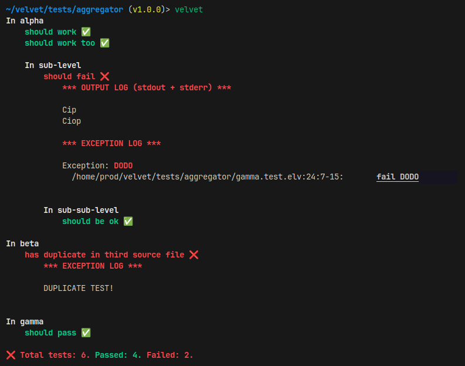
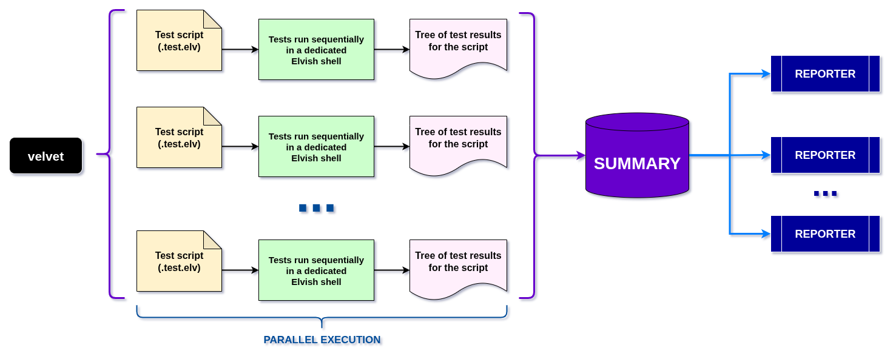

# velvet

_Smooth, functional testing in the Elvish shell_

**velvet** is a minimalist - yet _sophisticated_ - **test framework** and **runner**, enabling users to _run tests organized in hierarchical structures_ leveraging the _functional programming_ elegance of the [Elvish](https://elv.sh/) shell.



## Why Velvet?

I _love_ the expressive, **Gherkin**-like syntax that can be found in test software like [Jest](https://jestjs.io/), [Vitest](https://vitest.dev/) and [ScalaTest](https://www.scalatest.org/), but they are all focused on a specific technology - which usually doesn't feel as natural as a shell when dealing with **system programming** like file or network operations.

Given my passion for the [Elvish](https://elv.sh/) shell, I've designed this testing infrastructure by combining my favorite aspects of such frameworks, while applying my own perspective - especially focusing on _cross-technology, integration scenarios_.

## Installation

Velvet can be installed via **epm** - in particular:

```elvish
use epm

epm:install github.com/giancosta86/velvet
```

## Setup

In **rc.elv**, it is recommended to add the following lines:

```elvish
use github.com/giancosta86/velvet/main velvet

var velvet~ = $velvet:velvet~
```

This will make the `velvet` command globally available at the command prompt.

## Writing tests

Tests are defined in **test scripts** - by convention, files having `.test.elv` extension: they are _standard Elvish scripts_ that can also transparently invoke a handful of _additional builtin functions_, injected by Velvet and described below.

### Defining the test structure

The `>>` function - is the basic building block for _defining the test tree_ - adopting _a Gherkin-like descriptive notation_:

```elvish
>> First component {
  >> division operation {
    >> when divisor is not 0 {
      >> should return value {
        # Test code goes here
      }
    }

    >> when divisor is 0 {
      >> should crash {
        # Test code goes here
      }
    }
  }
}

>> Second component {
  >> other operation {
    >> should work {
      # Test code goes here
    }
  }
}
```

The innermost calls of `>>` define **tests**, which are the leaves in a tree of **sections**; in the example above, the tests are:

- **should return value**

- **should crash**

- **should work**

whereas the sections are:

- **First component**

- **division operation**

- **when divisor is not 0**

- **when divisor is 0**

- **Second component**

- **other operation**

**Please, note**: tests can also reside in the root of the script - when they are not contained in another `>>` block.

**Please, note**: the `>>` _function_ - called at the beginning of the line, has _no ambiguity_ with the `>>` _redirection operator_, used towards the end of the line.

**Please, note**: you might prefer to put titles into quotation marks, like this:

```elvish
>> 'Addition' {
  >> 'when a and b are positive' {
    >> 'should be positive' {
      # Test code goes here
    }
  }
}
```

This is perfectly acceptable, because `>>` can take an arbitrary number of strings before the block - including a single one with explicit delimiters.

A test has the **passed** outcome if its block ends with no exception; otherwise, it is marked as **failed**.

### Assertions

- `should-be [&strict] <expected>`: if the value passed via pipe (`|`) is not equal to the `<expected>` argument:

  1. Display both values

  1. If the `diff` command is available on the system, also show their differences

  1. Fail.

  **Please, note**: _equality_ is defined as follows:

  - if `&strict` is requested, the `eq` function is applied to the pair of values.

  - otherwise (the default), the _recursive minimalist string representations_ of both operand are compared.

- `should-not-be [&strict] <unexpected>`: if the value passed via pipe (`|`) is equal to the `<unexpected>` argument, display such value and fail.

- `expect-throws <block>`: requires `block` to throw an exception - or fails if it completed successfully.

  As a plus, the exception is output as value, so that it can be further inspected - especially via `get-fail-message`, which returns the message passed to the `fail` command, or `$nil` otherwise.

- `fail-test` always fails - with a predefined message.

## Running tests

To run tests from a directory containing one or more test scripts in its tree, just run this command in the Elvish shell:

> velvet

The command can be customized with a few _optional parameters_:

- `&must-pass`: if at least one test fails, the command throws an exception. **Default**: disabled.

- `&reporters`: an array of functions to report the test summary; each reporter function should receive a `summary` object - with no additional constraints. **Default**: a function writing to the console with _colors_ and _emojis_.

- `&put`: outputs the summary to Elvish's value channel. In this case, you'll probably want to set `&reporters=[]` - or to reporters not writing to the console. **Default**: disabled.

- `num-workers`: the number of parallel Elvish shells executing test scripts. **Default**: 8.

The script paths can also be passed as _variadic arguments_ to the `velvet` command:

```elvish
velvet <script 1> <script 2> ... <script N>
```

otherwise, all the test scripts located in the directory tree below the current working directory will be run.

## Execution flow



- Every test script runs its tests **sequentially** - in a (virtually) _dedicated shell_: consequently, the _current working directory_ and other global variables can be changed with no fear of interference

- Multiple test scripts are usually run _in parallel_ - and all the results are merged in the end, ready to be sent to the requested reporters and/or emitted to Elvish's value channel.

  **Please, note**:

  - different scripts can have _sections having the same titles_ - and the test results will be merged

  - on the other hand, _tests must have unique titles_

## Credits

Logo image generated by **ChatGPT** and enhanced with **Google Fonts** and **GIMP**.

## See also

- [Elvish](https://elv.sh/)
