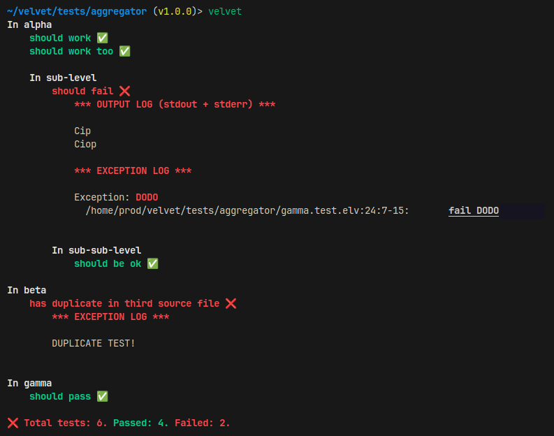
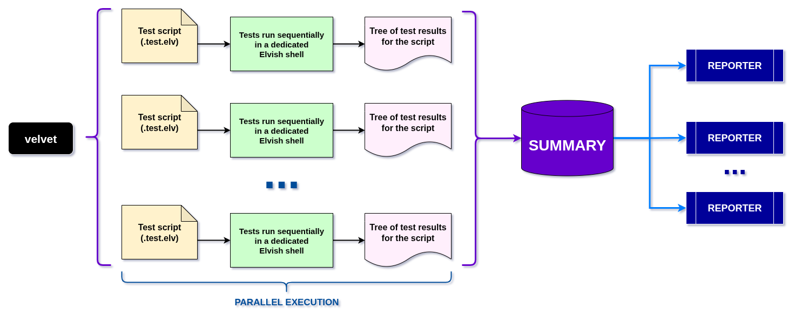

# velvet

_Smooth, functional testing in the Elvish shell_

**velvet** is a minimalist - yet fairly _sophisticated_ - **test framework** and **runner**, enabling users to run _tests organized in hierarchical structures_ leveraging the _functional programming_ elegance of the [Elvish](https://elv.sh/) shell.



## Installation

Velvet can be installed via **epm** - for example:

```elvish
use epm

epm:install github.com/giancosta86/velvet
```

## Setup

In **rc.elv**, it is recommended to add the following lines:

```elvish
use github.com/giancosta86/velvet/main velvet

var velvet~ = $velvet:velvet~
```

This will make the `velvet` command available.

## Running tests

To run tests from a directory containing one or more test scripts in its tree, just run this command in the Elvish shell:

> velvet

The command can be customized with a few _optional parameters_:

- `&must-pass`: if at least one test fails, the command throws an exception. **Default**: disabled.

- `&reporters`: an array of functions to report the test summary; each reporter function should receive a `summary` object - with no additional constraints. **Default**: a function writing to the console with _colors_ and _emojis_.

- `&put`: outputs the summary to Elvish's value channel. In this case, you'll probably want to set `&reporters=[]` - or to reporters not writing to the console. **Default**: disabled.

- `num-workers`: the number of parallel Elvish shells executing test scripts. **Default**: 8.

## Writing tests

## Architecture



## Credits

Logo image generated by **ChatGPT** and enhanced with **Google Fonts** and **GIMP**.

## See also

- [Elvish](https://elv.sh/)
