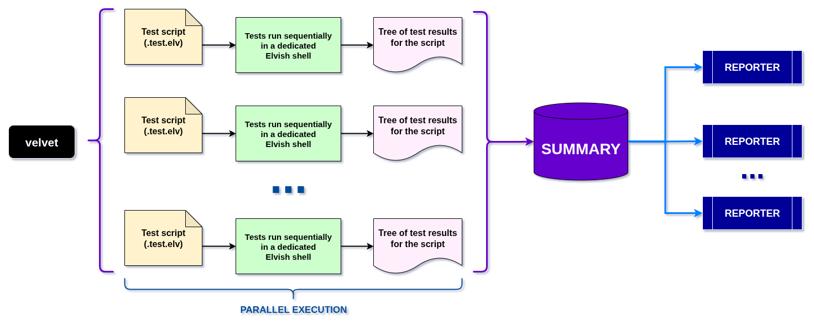

# velvet

_Smooth, functional testing in the Elvish shell_

**velvet** is a minimalist, _Vitest-like_ **test framework** and **runner**, enabling its users to _run tests organized in hierarchical structures_, while leveraging the _functional programming_ elegance as well as the _devops features_ of the [Elvish](https://elv.sh/) shell.


## Why Velvet?

I am definitely fond of the expressive, **Gherkin**-like syntax supported by _testing infrastructures_ like [Vitest](https://vitest.dev/), [Jest](https://jestjs.io/) and [ScalaTest](https://www.scalatest.org/), but each of them is based on a specific language - which usually doesn't feel as _natural_ as a shell when dealing with _system aspects_ like files, networks or _inter-process communication_.

Given my passion for the [Elvish](https://elv.sh/) shell, I've designed this _testing architecture_ by combining my favorite aspects of such frameworks, while applying my own perspective - especially focused on _cross-technology integration scenarios_.

## Installation

The library can be installed via **epm** - in particular:

```elvish
use epm

epm:install github.com/giancosta86/velvet
```

Even better, if you have [epm-plus](https://github.com/giancosta86/epm-plus), you can run:

```elvish
epm:install github.com/giancosta86/velvet@v4
```

or any other specific Git reference.

## Setup

In **rc.elv**, it is recommended to add the following lines:

```elvish
use github.com/giancosta86/velvet/velvet

var velvet~ = $velvet:velvet~
```

This will make the `velvet` command globally available at the command prompt.

## Writing tests

Tests are defined in **test scripts** - by convention, files having `.test.elv` extension: they are _standard Elvish scripts_ with a fundamental plus - they can also transparently invoke a handful of _additional built-in functions and namespaces_, especially from [Ethereal](https://github.com/giancosta86/ethereal), injected by Velvet and described all over this reference guide.

### Structuring your tests

The `>>` function is the basic building block for _defining the test tree_ - adopting _a totally arbitrary, Gherkin-like descriptive notation_:

```elvish
>> 'First component' {
  >> 'division operation' {
    >> 'when divisor is not 0' {
      >> 'should return value' {
        # Test code goes here
      }
    }

    >> 'when divisor is 0' {
      >> 'should crash' {
        # Test code goes here
      }
    }
  }
}

>> 'Second component' {
  >> 'other operation' {
    # More code goes here. You don't have to use 'should'
    # to define tests: you could use 'must', or just describe
    # the scenario as it is, with no formal prescription.
  }
}
```

The innermost calls of `>>` define **tests**, which are the leaves in a tree of **sections**; in the example above, the tests are:

- **should return value**

- **should crash**

- **other operation** - provided you don't include additional `>>` calls within its body.

whereas all the other occurrences of `>>` define **sections** - and each section can include _tests_ and _sub-sections_.

#### Notes

1. Unlike other frameworks, tests can also reside _in the root of the script_ - which simply occurs when they are not contained in another `>>` block.

1. `>>` can also be followed _just by the test title_, like in:

   ```elvish
   >> 'This is a test draft'
   ```

   The above code will define a **test draft**, whose body simply calls `fail-test` - thus equivalent to:

   ```elvish
   >> 'This is a test draft' {
     fail-test
   }
   ```

1. The `>>` _function_ - called at the beginning of its line - has _no ambiguity_ with the `>>` _redirection operator_, which always appears _after a command_.

1. When passing around the `>>` function - for example, when passing it to _a function residing inside a utility script_, where Velvet's _enhanced builtin namespace_ is not available - you can reference it from within a **.test.elv** test script as `$'>>~'`.

## Test outcome

A test can only have one of _two outcomes_:

- ✅**passed** if its block _ends with no exceptions_

- ❌**failed** if an exception was thrown; in particular, you can fail a test via Elvish's `fail` function, or via one of Velvet's _assertions_ or _block handlers_.

In the default console reporter, the **test output** - from both _stdout_ and _stderr_ - is displayed, together with the _exception log_, only _if the test fails_.

## Test commands: assertions vs block handlers

The body of a test usually contains one or more _test commands_ - which can be either _assertions_ or _block handlers_:

- **assertions** - commands taking a _subject_ (usually one, but sometimes more) via pipe, then performing checks via their _arguments_. Consequently, they are invoked _after_ generating the value they are testing. For example, `should-be` works like this:

  ```elvish
  + 83 7 |
    should-be 90
  ```

- **block handlers** - commands taking _one or more arguments_, whose last argument is _a block_; they are especially useful for _higher-order manipulation_, such as _exception checking_; as a consequence, they are invoked _before_ opening the code block they are testing. For example, `fails` works as follows:

  ```elvish
  fails { # Ensures `fail` is called, then emits the related value
    fail DODO
  } |
    should-be DODO
  ```

### Assertions

Assertions are freely accessible from any **.test.elv** test script - whereas utility **.elv** scripts can import them from the `assertions` barrel module provided by Velvet:

```elvish
use github.com/giancosta86/velvet/<VERSION>/assertions
```

They can be conceptually divided into the following categories:

- **core** - basic inter-process communication

- **comparisons** - focusing on comparison operators

- **collections** - collection-oriented assertions

- **file system** - dedicated to file-system objects

- **strings** - ensuring specific string invariants

#### Core assertions

- `should-be [&strict] <expected>`: if the _single_ value passed via pipe (`|`) is not equal to the `<expected>` argument:
  1. Displays both values

  1. If the `diff` command is available on the system, also shows their differences

  1. Fails.

  To test a variable, you can prepend the `put` function:

  ```elvish
  put $my-variable |
    should-be 90
  ```

  although, most frequently, you'll want to use a pipe:

  ```elvish
  my-command <arguments> |
    should-be <expected value>
  ```

  ##### Equality

  In Velvet, _equality_ is defined as follows:
  - the **default behavior** consists in comparing via `eq` the _minimized representations_ of both operands.

    ```elvish
    # EQUAL!
    put 90 |
      should-be (num 90)
    ```

    **DEFINITION**: the _minimized representation_ for any value is defined as follows:
    - if the value is a **number**, it is the _string_ denoting the number

    - if the value is a **list** or a **set** from [Ethereal](https://github.com/giancosta86/ethereal), it is a list whose items are the _minimized representations_ of its items

    - if the value is a **map**, it is a map whose keys and values are the _minimized representations_ of the keys and values

    - otherwise, it is _the value itself_

  - if `&strict` is passed to `should-be` or other equality-based assertions supporting such flag, the `eq` function is applied to the pair of values.

    ```elvish
    # NOT EQUAL!
    put 90 |
      should-be &strict (num 90)
    ```

- `should-not-be [&strict] <unexpected>`: just the complement of `should-be`.

- `should-emit [&strict] [&order-key] [&any-order] <expected>`: ensures that the values (including `echo`-emitted lines) passed via pipe (`|`) are _exactly the values_ in the `expected` collection.

  _Emission order matters_, unless the `order-key` option or its mutally-exclusive `any-order` counterpart flag is set; on the other hand, the `strict` option works according to the equality rules described within the context of `should-be`.

  ##### Example

  ```elvish
  {
    put Hello
    put 90
  } |
    should-emit [
      Hello
      90
    ]

  {
    echo Hello
    echo World
  } |
    should-emit [
      Hello
      World
    ]

  all [
    92
    90
    (num 98)
    95
  ] |
    should-emit &any-order [
      90
      92
      95
      98
    ]
  ```

  **Please, note**: in lieu of a `should-emit` with just one value, it's more expressive to use `should-be`.

- `should-not-emit [&strict] <unexpected>`: ensures that the values passed via pipe (`|`) _do not include any_ of the values in the `unexpected-values` collection; the `strict` option works according to the equality rules described within the context of `should-be`.

  ##### Example

  ```elvish
  {
    put Hello
    put 90
  } |
    should-not-emit [
      World
      4
      SomeOtherValue
    ]
  ```

#### Collection assertions

These assertions support **collections**, as defined by the `collections` module provided by [Ethereal](https://github.com/giancosta86/ethereal); in particular, a _collection_ can be:

- a **string**

- a **list**

- a **map**

- a **set** - provided by Ethereal's `set` module

Some assertions always behave according to the same pattern, others can change slightly - depending on the collection type, as follows:

- `should-contain [&strict] <expected>`: receives a _collection_ via pipe (`|`) and a `value` as argument, then:
  - if the collection is a **string**, ensures that `value` is _a substring_

  - if the collection is a **list**, ensures that `value` is _contained in the list_

  - if the collection is a **map**, ensures that `value` is _a key of the map_

  - if the collection is a **set** from [Ethereal](https://github.com/giancosta86/ethereal), ensures that `value` belongs to the set

  In all cases, the `strict` flag is supported - enabling _strict equality_, as described in the related section above.

  ##### Example

  ```elvish
  # String
  put 'Greetings, magic world!' |
    should-contain magic

  # List
  put [alpha beta gamma] |
    should-contain beta

  # Map
  put [
    &a=90
    &b=92
    &c=95
  ] |
    should-contain b

  # Set
  use github.com/giancosta86/ethereal/v1/set

  all [alpha beta gamma] |
    set:of |
    should-contain beta
  ```

- `should-not-contain [&strict] <unexpected>`: the complement of `should-contain`.

  ##### Example

  ```elvish
  # String
  put 'Hello, everybody!' |
    should-not-contain world

  # List
  put [alpha beta gamma] |
    should-not-contain ro

  # Map
  put [
    &a=90
    &b=92
    &c=95
  ] |
    should-not-contain omega

  # Set
  use github.com/giancosta86/ethereal/v1/set

  set:of alpha beta gamma |
    should-not-contain ro
  ```

- `should-contain-all [&strict] <expected>`: ensures the collection contains **all** the expected values - which can be contained in any collection type.

- `should-contain-none [&strict] <unexpected>`: ensures the collection contains **none** of the expected values - which can be contained in any collection type.

- `should-be-empty`: ensures the collection is empty.

- `should-not-be-empty`: ensures the collection is not empty.

#### Comparison assertions

Each of them applies a _comparison operator_ between the **subject** and the **argument**:

- `should-be-at-least` (&ge;)

- `should-be-at-most` (&le;)

- `should-be-greater-than` (&gt;)

- `should-be-less-than` (&lt;)

Unlike the core assertions, there is no `&strict` flag, because the **argument** is always cast to match the kind of the **subject**.

##### Example

```elvish
put (num 92) |
  should-be-greater-than 90 # Cast to the kind of the subject (number)
```

#### File-system assertions

These assertions take **one or more** _file-system-entries_ via pipe, _test each of them_ and finally fail if _at least_ one entry does not pass the test - also displaying _all the failing entries_.

They are named according to the related functions in the standard `os` module:

- `should-be-regular`

- `should-not-be-regular`

- `should-be-dir`

- `should-not-be-dir`

- `should-exist`

- `should-not-exist`

##### Example

```elvish
# Just one file
put alpha.txt |
  should-be-regular

# Multiple files
all [
  alpha.txt
  beta.txt
] |
  should-be-regular
```

#### Strings

- `should-match-regex <regex>`: ensures the subject matches - via `re:match` - the given regex.

- `should-not-match-regex <regex>`: the complement of `should-match-regex`.

- `should-contain-snippet <line-collection>`: ensures the _collection_ of lines passed as argument, when merged with "\n", generate a string contained in the subject string.

- `should-not-contain-snippet <line-collection>`: the complement of `should-contain-snippet`.

- `should-have-prefix <prefix>`: ensures the subject begins with `<prefix>`.

- `should-not-have-prefix <prefix>`: the complement of `should-have-prefix`.

- `should-have-suffix <suffix>`: ensures the subject ends with `<suffix>`.

- `should-not-have-suffix <suffix>`: the complement of `should-have-suffix`.

### Block handlers

Block handlers are freely accessible from any **.test.elv** test script - whereas utility **.elv** scripts can import them from the `block-handlers` barrel module provided by Velvet:

```elvish
use github.com/giancosta86/velvet/<VERSION>/block-handlers
```

They can be summarized as follows:

- `fails <block>`: requires `block` to call `fail` - directly or indirectly, of course - then outputs the **content** of such failure; the block handler itself **fails** _if_ `fail` _is not invoked by the block_.

  **Please, note**: if another type of exception is thrown by `block` - for example, a syntax error, or a division-by-zero error - it simply _passes through_.

  **Please note**: `fail` is preferable to `throws` whenever applicable.

  ##### Example

  ```elvish
  fails {
    fail Dodo
  } |
    should-be Dodo
  ```

- `throws [&swallow] <block>`: the most general way to ensure that `block` _throws an exception_ of any kind - **failing** _if the block completes successfully_. The function emits:
  - by default:
    - the **exception** itself, as a _value_ on **stdout**, so it can be further inspected via the `exception` module provided by [Ethereal](https://github.com/giancosta86/ethereal):

      ```elvish
      throws {
        fail DODO
      } |
        exception:is-return |
        should-be $false
      ```

    - the **bytes** emitted by the block, as _lines_ on **stderr**

  - if the `&swallow` flag is enabled: the **actual output** of the block - both _bytes_ and _values_ - is emitted in lieu of the exception.

  **Please, note**: In general, you should use the `fails` block handler when you focus on `fail`-based exceptions.

  ##### Example

  ```elvish
  # This works fine
  throws {
    fail DODO
  }

  # This will fail, saying a failure was expected!
  throws {
    # This block throws nothing
  }

  # This will emit only the values, not the exception
  throws &swallow {
    echo Hello
    echo World
    fail DODO
  } |
    should-emit [
      Hello
      World
    ]
  ```

- `assertion-fails <assertion-reference> <block>`: specific version of `fails` taking as arguments:
  - a _reference_ to the **assertion** that should fail - for example, `should-be`, or the output of the `src` builtin function called from within the _assertion script_ or its _test script_

  - a _block_ where such assertion is violated.

  It is especially useful when testing new assertions.

  ##### Example

  ```elvish
  assertion-fails should-be {
    put 90 |
      should-be 92
  }
  ```

- `capture [&throws] [&styled] [&stream=both|out|err|none] &type=[both|bytes|values] <block>`: fine-grained tool to test the output of a block in a very flexible way.

  This block handler invokes the `command:capture` function provided by [Ethereal](https://github.com/giancosta86/ethereal); then:
  1. **emits the block-emitted output** as a `"\n"`-concatenated string; by default, **the output is emitted unstyled** - ignoring the formatting tags created by `styled` - unless the `&styled` flag is passed.

     The captured output can be fine-tuned via the `&stream` and `&type` options, as explained in the documentation of the `command:capture` function from [Ethereal](https://github.com/giancosta86/ethereal).

  1. the **exception status** is taken into account:
     - if the block _completes successfully_ and the `&throws` option is set, `capture` **fails**, declaring that _an exception was expected_

     - if the block _throws an exception_ and the `&throws` option is not set, `capture` **fails**, declaring that _no exception was expected_.

  #### Example

  ```elvish
  capture {
    echo Hello
    echo World
  } |
    should-be "Hello\nWorld"
  ```

  In this example, you could apply any _string-related assertion_ to the output of the `capture` block handler - or even _store the value into a variable_, then apply multiple assertions.

  For a wider range of examples, please refer to its [test script](block-handlers/capture.test.elv).

## Tools

Tools are _utility constructs_; just like _assertions_ and _block handlers_, they are all available in the _default namespace_ of any test scripts - whereas utility Elvish scripts can access them via the following _module import_:

```elvish
use github.com/giancosta86/velvet/<VERSION>/tools
```

- `fail-test` takes _no arguments_ and _always fails_ - with a predefined message: it's perfect for _quickly sketching out a new test_ in test iterations - although one can simply omit the test body when calling `>>` to obtain the same effect.

- `run-dual` takes in input - as _an argument_ or _via pipe_ - the output of the `src` command invoked by the caller itself - and spawns an Elvish shell running the **dual script**, i.e., the script having just **.elv** extension. This is particularly useful to ensure that _barrel modules_, merely re-exporting symbols, do not contain errors.

  ##### Example

  ```elvish
  >> 'The barrel module' {
    >> 'should have no syntax error' {
      run-dual (src)
    }
  }
  ```

## Example test script

The following script could be saved as a `.test.elv` file:

```elvish
>> 'In arithmetic' {
  >> 'addition' {
    >> 'should work' {
      + 89 1 |
        should-be 90
    }
  }

  >> 'multiplication' {
    >> 'should return just the expected value' {
      var result = (* 15 6)

      put $result |
        should-be 90

      put $result |
        should-not-be 12
    }
  }

  >> 'division' {
    >> 'when dividing by 0' {
      >> 'should fail' {
        throws {
          / 92 0
        } |
          to-string (all)[reason] |
          should-contain divisor
      }
    }
  }

  >> 'custom fail' {
    >> 'should be handled and inspectable' {
      fails {
        if (== (% 8 2) 0) {
          fail '8 is even!'
        }
      } |
        should-be '8 is even!'
    }
  }
}
```

Then, assuming it was saved to **maths.test.elv**, we could run:

> velvet maths

## Running tests

To run _all the tests_ within _a directory tree_, just run this command in the Elvish shell:

> velvet

The command can be customized via a few _optional parameters_:

- `&flawless`: if _at least one test fails_, or if _at least one test script crashes_, the command _throws an exception_. **Default**: disabled.

- `&reporters`: a list of _functions to report the test summary_; each reporter receives a `summary` map object - processing it as needed.

  **Default**: the reporter writing _just failed tests_ to the console with _colors_ and _emojis_.

- `&verbose`: mutually exclusive with the `&reporters` option, always using the **full console reporter**.

- `&emit-summary`: outputs the summary to the _value channel_. In this case, you'll probably want to set `&reporters=[]` or to a list containing _reporters not writing to the console_ - or simply pipe to `only-values`.

  **Default**: disabled.

- `num-workers`: the (actually maximum) number of _parallel Elvish shells_ executing the test scripts. **Default**: 8.

The _requested script paths_ can also be passed as _variadic arguments_ to the `velvet` command:

```elvish
velvet <script 1> <script 2> ... <script N>
```

otherwise, _all the test scripts located in the directory tree_ below the current working directory will be run.

## Execution flow



- _Every test script_ runs its tests **sequentially** - in a (virtually) _dedicated shell_: consequently, the _current working directory_ and other global variables can be changed with _no fear of interference_, as long as the script _sets their initial values_ as required.

- _Multiple test scripts_ are usually run **in parallel** - and _all the results are merged_ to a final **summary**, ready to be sent to the _requested reporters_ and/or emitted to Elvish's _value channel_.

  **Please, note**:
  - separate scripts can have _sections with the same titles_ - and _the test results will be merged_ as expected

  - on the other hand, _each test must have a unique path in the test tree_ - that is, the sequence of its **section titles** combined with its own **test title**; otherwise, _all the duplicate occurrences will be merged_ into a _single_ `DUPLICATE!` failing test result

## Predefined reporters

### Console

There are _2 console reporters_, writing the overall **summary** to the _console_ and sharing these presentation rules:

- In each section, **test results** come _before_ **sub-sections**

- **Test results** are shown in _alphabetical order_

- **Sections** are listed in _alphabetical order_, too

- The **stats** are displayed at the end

As for _the differences_ between such reporters:

- the **terse** reporter - at `reporting/console/terse:report~`- only displays _failed tests_. It is the **default** one when running the `velvet` command

- the **full** reporter - `reporting/console/full:report~`- lists _all tests_ - each one with its outcome; however, _it won't display the output of passed tests_.

### JSON

Writes the passed `summary` object to a given JSON file.

The reporter must be created via a _factory function_ - `reporting/json/create-reporter`, which takes in input a file path and emits the actual _reporter function_.

For example:

```elvish
var json-reporter = (json:create-reporter $json-report-path)

velvet:velvet &reporters=[$json-reporter]
```

### Reporter spy

A _reporter spy_ is an object providing both a _reporter function_ and a _getter_ emitting the latest **summary** passed to the former function - which can be especially useful when _testing custom reporters_.

It is provided by the `reporting/spy` module, exporting the `create` _factory function_:

```elvish
var spy = (spy:create)
```

which instantiates an object having the following methods:

- `reporter`: the actual function to be passed to the `velvet` command, via its `reporters` list option

- `get-summary`: returns the latest **summary** value passed to the associated `reporter`

```elvish
velvet:velvet &reporters=[$spy]

var summary = ($spy[get-summary])
```

## Ethereal namespaces

The [Ethereal](https://github.com/giancosta86/ethereal) library provides a rich set of _general-purpose modules_ for the Elvish shell; Velvet automatically imports some of such modules, to _simplify the development_ of test scripts. For example:

```elvish
# fs is a module from Ethereal
# that is automatically provided by Velvet.
fs:with-temp-file { |temp-path|
  echo alpha >> $temp-path
  echo beta >> $temp-path

  slurp < $temp-path |
    should-be "alpha\nbeta\n"
}
```

The **available namespaces** at present are listed in [a dedicated script](test-script/ethereal.elv).

Please, refer to [Ethereal](https://github.com/giancosta86/ethereal)'s documentation for further details.

## Extending Velvet

### Creating a custom assertion

Custom assertions are merely _functions_ taking a **subject** via pipe and zero or more arguments; they usually reference the [assertion](assertion.elv) and [output](output.elv) modules provided by Velvet:

```elvish
use github.com/giancosta86/velvet/<VERSION>/assertion
use github.com/giancosta86/velvet/<VERSION>/output
```

#### Implementing the assertion

The following guidelines are recommended:

- the assertion should be named `should-*`.

- the script should be named like the assertion, with **.elv** extension.

- the subject should be obtained via `one`, sometimes processed via `assertion:get-input`:

  ```elvish
  var subject = (one)

  # OR

  var subject = (one | assertion:get-input &strict=$strict)
  ```

- the number of arguments, even no arguments, depends on the actual operation to be performed on the subject; some arguments could also be processed via `assertion:get-input`

- to signal an assertion failure, the `assertion:fail` function should **always** be used:

  ```elvish
  use github.com/giancosta86/velvet/<VERSION>/assertion

  fn should-... { |...|
    var pass = ... # Here, define the predicate that must be satisfied

    if (not $pass) {
      assertion:fail (src)
    }
  }
  ```

  Furthermore, to display values in the failing branch, please consider the `contrast` and `display-wrong` functions provided by the [output](output.elv) module.

#### Testing the assertion

The following guidelines are recommended:

- the script should be named like the assertion, with **.test.elv** extension

- in tests where the assertion is expected to fail, the `assertion-fails` block handler should be invoked as follows:

  ```elvish
  assertion-fails (src) {
    # Here, call the assertion
  }
  ```

#### Using the assertion

Considering that _assertions are merely functions_, you can use them wherever needed just by _importing them_ or, in special contexts, even _using them within their same module_, as in this toy example:

```elvish
use github.com/giancosta86/velvet/<VERSION>/assertion
use github.com/giancosta86/velvet/<VERSION>/output

fn should-be-strictly-ninety {
  var subject = (one)

  if (not (eq $subject (num 90))) {
    output:contrast [
      &red-description=Actual
      &red=$subject
      &green-description=Expected
      &green='(num 90)'
      &show-diff=$false
    ]
    assertion:fail (src)
  }
}

put 90 |
  should-be-strictly-ninety # more simply: should-be &strict (num 90)
```

### Creating a custom reporter

A reporter is nothing but a function - conventionally named `report` - taking a single argument, of type `summary`, which is declared in the [summary](summary.elv) module.

For details about _the implementation_ of a reporter, please refer to the [reporting](reporting/) directory.

To use a reporter, pass its **fully-qualified name** (including the trailing `~`) as an item in the `&reporters` array flag of the `velvet` command.

## Frequently asked questions

### Are there setup and teardown?

Nope, because **velvet** is designed to be _minimalist_ - and you can _achieve the same results_ via the Elvish language - especially via a _custom block handler_.

### `echo`, `print`, `pprint` and other functions have no output: why?

In the _console reporters_, **successful tests do not output their stdout/stderr**, by design.

Should you need further inspection, you can make the test fail just by adding a call to `fail-test` - which takes no arguments.

### Is there a recommended style to structure the tests?

The user is _absolutely free_: the system only provides the `>>` function to _create nodes in the test tree_: all the rest depends on the specific _expressive requirements_ - which _could change from one test script to another_ or even _within the same script_.

### Why are the tests not in the same order as in my script?

Because they are _alphabetically sorted_ - a choice stemming from the fact that, in Velvet, _sections can span multiple test scripts_, as required by the _testing style_ and by the _isolation needs_ in terms of global variables like the _current working directory_.

## Credits

Logo image generated by **ChatGPT** and manually enhanced with **Google Fonts** and **GIMP**.

## See also

- [Ethereal](https://github.com/giancosta86/ethereal) - _Elegant utilities for the Elvish shell_

- [epm-plus](https://github.com/giancosta86/epm-plus) - _Package versioning for epm in Elvish_

- [Elvish](https://elv.sh/)
